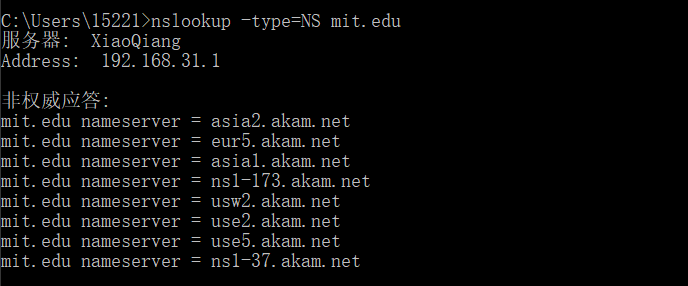
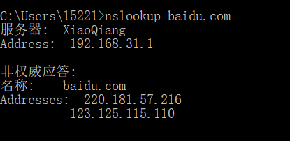
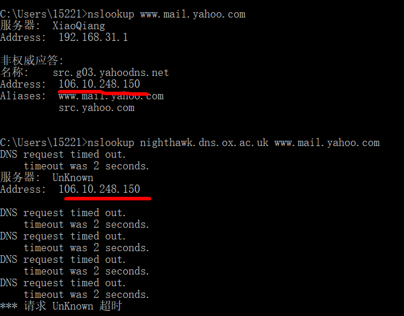
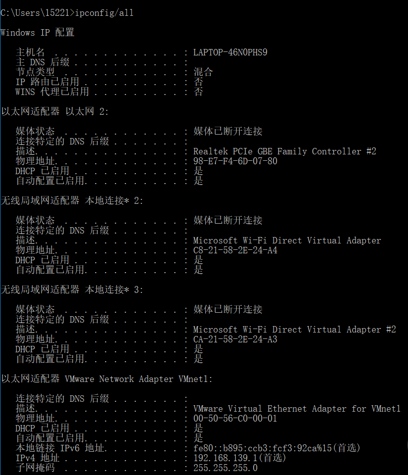

# WireSharkLab-DNS

## 实验材料
[Wireshark_DNS_v6.01](Wireshark_DNS_v6.01.pdf)

## 1.nslookup

  nslookup工具允许主机查询任何指定的DNS服务器的DNS记录。DNS服务器可以是根DNS服务器，顶级域DNS服务器，
  权威DNS服务器或中间DNS服务器。要完成此任务，nslookup将DNS查询发送到指定的DNS服务器，
  然后接收DNS回复，并显示结果。
  
      nslookup www.mit.edu
  

 
 此命令的响应提供两条信息：（1）提供响应的DNS服务器的名称和IP地址；
 （2）响应本身，即 www.mit.edu 的主机名和IP地址。
 
 非权威应响应意味着这个响应来自某个服务器的缓存，而不是来自权威MIT DNS服务器。
 
    nslookup -type=NS mit.edu
    

  
 添加了选项"-type=NS"和域名"mit.edu"。这将使得nslookup将NS记录发送到默认的本地DNS服务器。
 换句话说，-type=NS表示只要求发送mit.edu的权威DNS的主机名，而不要求ip地址 
 （当不使用-type选项时，nslookup使用默认值，即查询A类记录。）上述屏幕截图中，首先显示了提供响应的DNS服务器（
 这是默认本地DNS服务器）以及八个MIT域名服务器。这些服务器中的每一个确实都是
 麻省理工学院校园主机的权威DNS服务器。然而，nslookup也表明该响应是非权威的，
 这意味着这个响应来自某个服务器的缓存，而不是来自权威MIT DNS服务器。

 ### nslookup命令的一般语法:
    nslookup -option1 -option2 host-to-find dns-server
    
 ** 问题解答 **
 
1. 运行nslookup以获取一个亚洲的Web服务器的IP地址。该服务器的IP地址是什么？

2. 运行nslookup来确定一个欧洲的大学的权威DNS服务器。

3. 运行nslookup，使用问题2中一个已获得的DNS服务器，来查询Yahoo!邮箱的邮件服务器。它的IP地址是什么？

请求失败，没办法获得yahoo邮箱服务器地址，只给了牛津大学权威dns服务器的地址。

以下面方式得到雅虎邮箱服务器地址

## ipconfig

ipconfig（对于Windows）和ifconfig（对于Linux / Unix）是主机中最实用的程序，
尤其是用于调试网络问题时。这里我们只讨论ipconfig，尽管Linux / Unix的ifconfig与其非常相似。
ipconfig可用于显示您当前的TCP/IP信息，包括您的地址，DNS服务器地址，适配器类型等。
例如，您只需进入命令提示符，输入

    ipconfig/all
    
 所有关于您的主机信息都类似如下面的屏幕截图所显示。
 
 
 
 查看主机缓存的最近获得的DNS记录：
    
    ipconfig /displaydns
    
   
 
 每个条目显示剩余的生存时间（TTL）（秒）、数据长度、主机名等。
 
 要清除缓存，请输入

    ipconfig /flushdns

  清除了所有条目并从hosts文件重新加载条目。
  
     
     
## 3. 使用Wireshark追踪DNS

