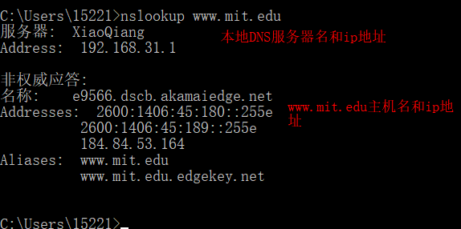
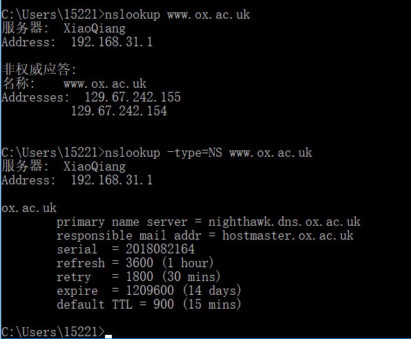
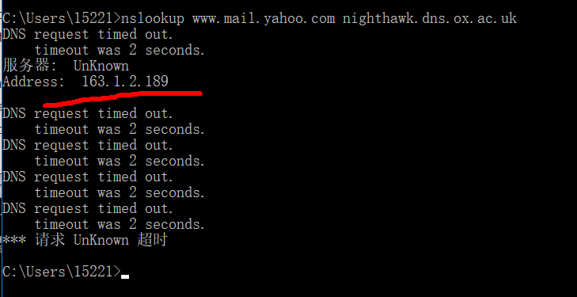
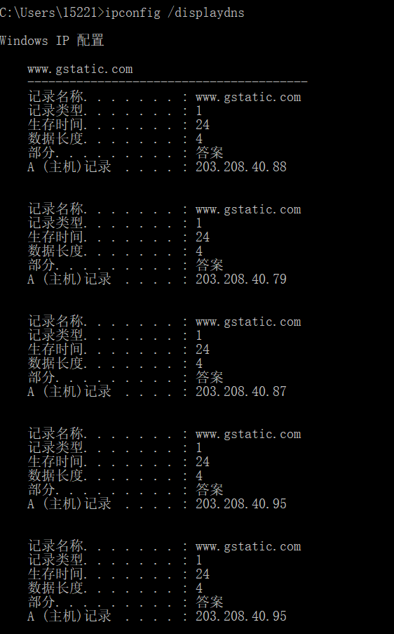
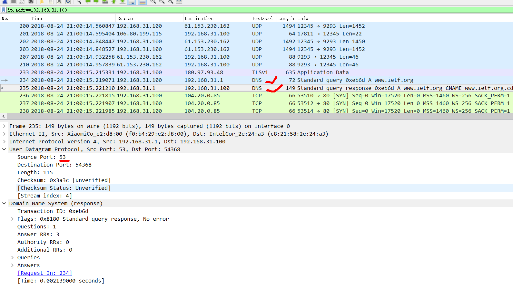
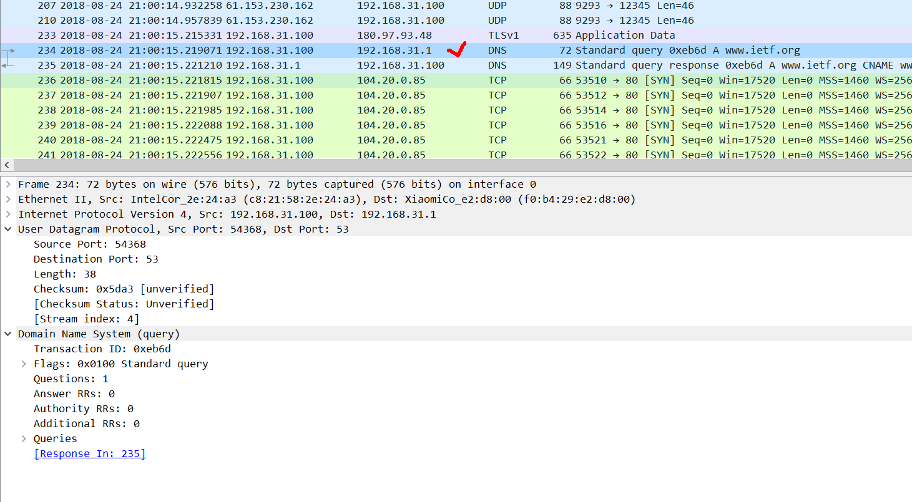
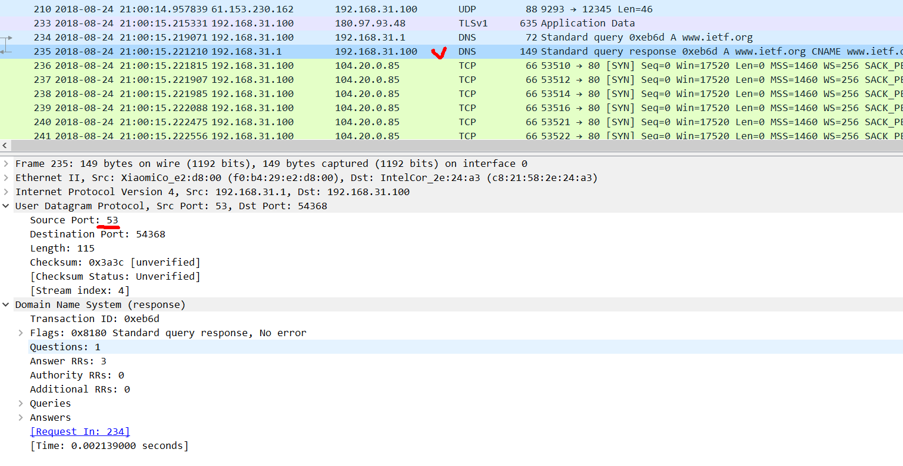
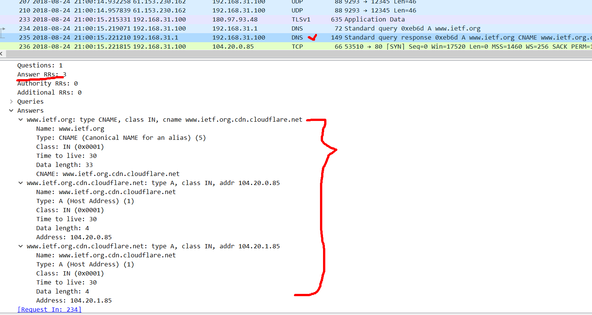
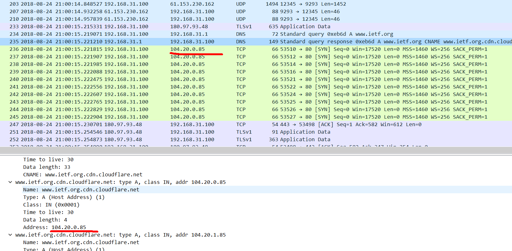

# WireSharkLab-DNS

## 实验材料
[Wireshark_DNS_v6.01](Wireshark_DNS_v6.01.pdf)

## 1.nslookup

  nslookup工具允许主机查询任何指定的DNS服务器的DNS记录。DNS服务器可以是根DNS服务器，顶级域DNS服务器，
  权威DNS服务器或中间DNS服务器。要完成此任务，nslookup将DNS查询发送到指定的DNS服务器，
  然后接收DNS回复，并显示结果。
  
      nslookup www.mit.edu
  

 
 此命令的响应提供两条信息：（1）提供响应的DNS服务器的名称和IP地址；
 （2）响应本身，即 www.mit.edu 的主机名和IP地址。
 
 非权威应响应意味着这个响应来自某个服务器的缓存，而不是来自权威MIT DNS服务器。
 
    nslookup -type=NS mit.edu
    

  
 添加了选项"-type=NS"和域名"mit.edu"。这将使得nslookup将NS记录发送到默认的本地DNS服务器。
 换句话说，-type=NS表示只要求发送mit.edu的权威DNS的主机名，而不要求ip地址 
 （当不使用-type选项时，nslookup使用默认值，即查询A类记录。）上述屏幕截图中，首先显示了提供响应的DNS服务器（
 这是默认本地DNS服务器）以及八个MIT域名服务器。这些服务器中的每一个确实都是
 麻省理工学院校园主机的权威DNS服务器。然而，nslookup也表明该响应是非权威的，
 这意味着这个响应来自某个服务器的缓存，而不是来自权威MIT DNS服务器。

 ### nslookup命令的一般语法:
    nslookup -option1 -option2 host-to-find dns-server
    
 ** 问题解答 **
 
1. 运行nslookup以获取一个亚洲的Web服务器的IP地址。该服务器的IP地址是什么？

2. 运行nslookup来确定一个欧洲的大学的权威DNS服务器。

3. 运行nslookup，使用问题2中一个已获得的DNS服务器，来查询Yahoo!邮箱的邮件服务器。它的IP地址是什么？

请求失败，没办法获得yahoo邮箱服务器地址，只给了牛津大学权威dns服务器的地址。

以下面方式得到雅虎邮箱服务器地址

## ipconfig

ipconfig（对于Windows）和ifconfig（对于Linux / Unix）是主机中最实用的程序，
尤其是用于调试网络问题时。这里我们只讨论ipconfig，尽管Linux / Unix的ifconfig与其非常相似。
ipconfig可用于显示您当前的TCP/IP信息，包括您的地址，DNS服务器地址，适配器类型等。
例如，您只需进入命令提示符，输入

    ipconfig/all
    
 所有关于您的主机信息都类似如下面的屏幕截图所显示。
 
 
 
 查看主机缓存的最近获得的DNS记录：
    
    ipconfig /displaydns
    
   
 
 每个条目显示剩余的生存时间（TTL）（秒）、数据长度、主机名等。
 
 要清除缓存，请输入

    ipconfig /flushdns

  清除了所有条目并从hosts文件重新加载条目。
  
   
     
## 3. 使用Wireshark追踪DNS

1. 使用ipconfig清空主机中的DNS缓存。
2. 打开浏览器并清空浏览器缓存。 （若使用Internet Explorer，转到工具菜单并选择Internet选项；然后在常规选项卡中选择删除文件。）
3. 打开Wireshark，然后在过滤器中输入“ip.addr==your_IP_address”，您可以先使用ipconfig获取你的IP地址。此过滤器将删除既从你主机不发出也不发往你主机的所有数据包。
4. 在Wireshark中启动数据包捕获。
5. 使用浏览器访问网页： http://www.ietf.org
6. 停止数据包捕获。

  结果如下
  
  
  
 ### 问题解答
 
 找到DNS查询和响应消息。它们是否通过UDP或TCP发送？
 
 答：DNS服务都是通过UDP发送（要求快速，tcp需三次握手太慢）。
 
 DNS查询消息的目标端口是什么？ DNS响应消息的源端口是什么？
 
 答：53；53.
 
 
 
 
 DNS查询消息发送到哪个IP地址？使用ipconfig来确定本地DNS服务器的IP地址。这两个IP地址是否相同？
 
 答：如上图所示，发送到192.168.31.1。该地址是本地dns服务器的ip地址，也是本主机的默认网关。
 
 检查DNS查询消息。DNS查询是什么类型的？查询消息是否包含任何"answers"？
 
 答：标准查询，即为A类型。查询消息不包含任何answsers。
 
 
 检查DNS响应消息。提供了多少个"answers"？这些答案具体包含什么？
 
 答：三个答案。
 
 
 考虑从您主机发送的后续TCP SYN数据包。 SYN数据包的目的IP地址是否与DNS响应消息中提供的任何IP地址相对应？
 
 答：相对应。
 
 
  这个网页包含一些图片。在获取每个图片前，您的主机是否都发出了新的DNS查询？
  
  答：没有。
  
  ### 现在来看看nslookup
  
1. 启动数据包捕获。
2. 使用nslookup查询 www.mit.edu
3. 停止数据包捕获。

结果如下：

 
 
### 问题解答

DNS查询消息的目标端口是什么？ DNS响应消息的源端口是什么？

答：53

DNS查询消息的目标IP地址是什么？这是你的默认本地DNS服务器的IP地址吗？

答：192.168.31.1，是。

检查DNS查询消息。DNS查询是什么"Type"的？查询消息是否包含任何"answers"？

答：标准查询，即A类型。不包含。

检查DNS响应消息。提供了多少个"answers"？这些答案包含什么？

答：3个。
 
