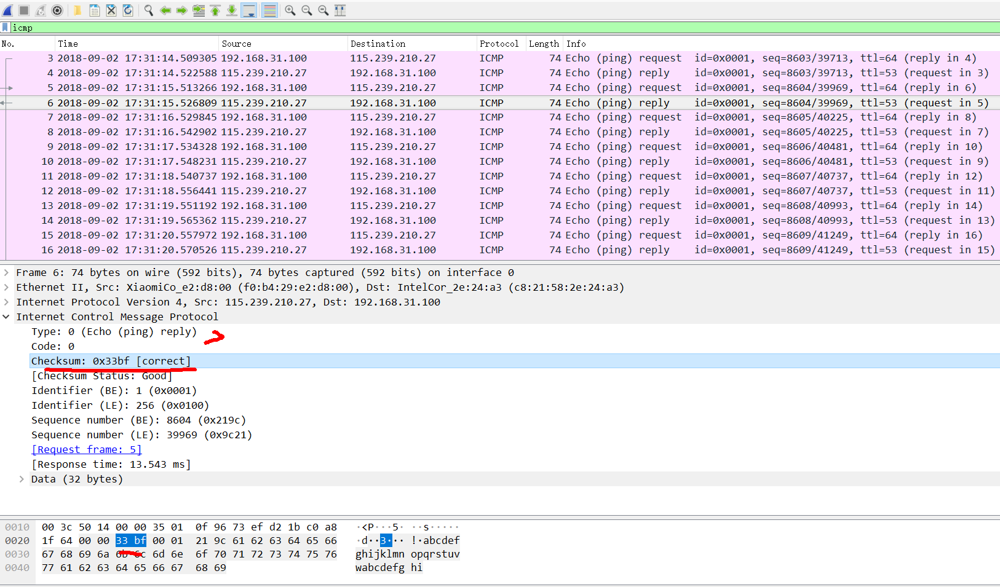

# WireSharkLab-ICMP

## 实验材料

[Wireshark_ICMP_v6.0](Wireshark_ICMP_v6.0.pdf)

## 概述

  在本实验中，我们将探讨ICMP协议的几个方面：
1. Ping程序生成的ICMP报文;
2. Traceroute程序生成的ICMP报文;
3. ICMP报文的格式和内容。

## ICMP和Ping

  让我们通过捕获Ping程序生成的数据包开始我们的ICMP冒险。Ping程序是一个简单的工具，
  允许任何人（例如，网络管理员）验证主机是否存在。源主机中的Ping程序将数据包发送到目标IP地址;
  如果目标是在运行的，则目标主机中的Ping程序通过将数据包发送回源主机来响应。
  这两个Ping数据包都是ICMP数据包。

  按以下步骤操作：
  
+ 打开windows命令提示符(点击windows图标，输入cmd）；
+ 打开wireshark，并开始捕获数据包；
+ 在命令行输入“ping -n 10 hostname",-n 10表示发送10次ping报文，默认是发送四次。
 
+ 当ping程序停止，停止wireshark的分组捕获。

  从命令行窗口我们可以看到，源ping程序发送了10个查询包并收到了10个响应。
  另请注意，对于每个响应，也计算了往返时间（RTT），对于10个数据包平均为14.2毫秒。
  
  

  上图提供了在将“icmp”输入过滤器显示窗口后Wireshark输出的屏幕截图。
  请注意，数据包列表显示20个数据包：源发送的10个Ping查询和源接收的10个Ping响应。
  另请注意，源IP地址是192.168/12格式的私有地址（在NAT后面）;
  目的地的IP地址是百度Web服务器的IP地址。现在看一下第一个分组的详细信息。数据包内容区域
  提供有关此数据包的信息。我们看到该数据包中的IP数据报具有协议号01，这是ICMP的协议号。
  这意味着IP数据报的有效载荷是ICMP数据包。
  
  
  上图关注相同的ICMP，但侧重观察数据包内容窗口中ICMP协议信息。
  观察到该ICMP数据包是类型8和代码0 - 所谓的ICMP“回应请求”数据包。
（请参见课本的图4.23。）另请注意，此ICMP数据包包含校验和，标识符和序列号。

### 问题解答

1. 您的主机的IP地址是多少？目标主机的IP地址是多少？

答：192.168.31.100和115.239.210.27。

2. 为什么ICMP数据包没有源和目标端口号？

答： ICMP数据包没有源和目标端口号，因为它旨在在主机和路由器之间传递网络层信息，而不是在应用层进程之间传递。
每个ICMP数据包都有一个“类型”和一个“代码”。类型/代码组合标识正在接收的特定消息。
由于网络层本身解释所有ICMP消息，因此不需要端口号来将ICMP消息定向到应用层进程。

3. 检查主机发送的ping请求数据包之一。ICMP的类型和代码是多少？
   该ICMP数据包还有哪些其他字段？校验和，序列号和标识符字段有多少字节？
   
 答：类型为8，代码字段为0.还有校验和（checksum）、标识（id）、序号（seq number）字段。
 
     校验和两个字节、id两个字节、序列号两个字节。
     
     
     
     
     

4. 检查相应的ping回复数据包。ICMP类型和代码字段是多少？
   该ICMP数据包还有哪些其他字段？校验和，序列号和标识符字段有多少字节？
   
 答：ICMP类型和代码字段分别是0和0.
     还包含校验和，序列号和标识符字段，都是2字节。
     
