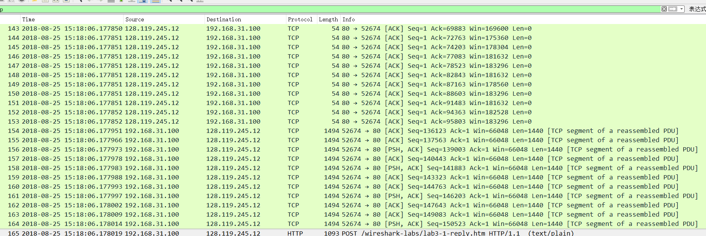
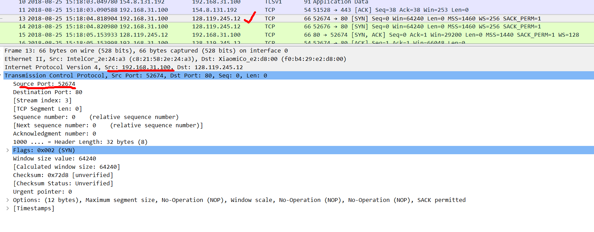
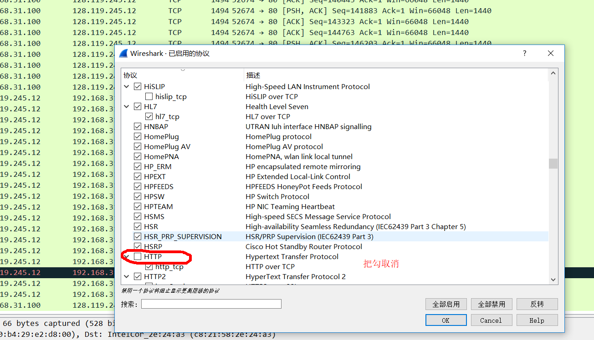

# WireSharkLab-TCP

## 实验材料
[Wireshark_TCP_v6.0](Wireshark_TCP_v6.0.pdf)

## 概述
  通过实例来详细地研究TCP协议，具体是通从你的计算机过到一个远程主机传输一个150KB的文件
  （包含Lewis Carrol’s Alice’s Adventures in Wonderland的文本）来分析TCP报文段的发送和接收。
  包含以下内容：
  
1. 学习TCP利用序号(seq)和确认号(ack)来提供数据的可靠传输。
2. 学习TCP拥塞控制算法——慢启动和拥塞避免。
3. 学习TCP的接收器通知流控制机制。
4. 考虑TCP连接设置并研究计算机和服务器之间TCP连接的性能（吞吐量和往返时间）。

## 捕获从计算机到远程服务器的批量TCP传输

1. 从http://gaia.cs.umass.edu/wireshark-labs/alice.txt复制全文，在你的计算机上建立新的文本文件TCP.txt，
把复制的文本粘贴到TCP.txt,保存。
2. 打开http://gaia.cs.umass.edu/wireshark-labs/TCP-wireshark-file1.html，点击网页中的选择文件按钮，选择
TCP.txt文件。注意先别点击开始上传按钮。
3. 打开WireShark，启动开始捕获，回到浏览器点击“Upload alice.txt file”按钮，等上传完毕，浏览器会出现一条
congratulations信息。
4. 停止捕获。

### 结果如下：

## 首先看一下捕获的信息

  首先，在显示过滤器那里输入tcp，回车。现在，你看到的应该是你的计算机和gaia.cs.umass.edu之间的
  一系列TCP或者HTTP信息。
  
  **可以看到tcp建立连接的三次握手（包含一个SYN信息）：**

  
  **可以看到一条HTTP POST信息（可看到HTTP POST是在所有TCP报文段传输后才一次性传输过去的)**

  **取决于你的WireShark版本，可能看到一系列HTTP Continuation信息，本人的版本并没有显示，
  其实实际上没有HTTP Continuation这种信息，这只是WireShark来告知你有很多TCP报文段被用来传
  输同一个HTTP信息（因为文件太大了，需要分组）。**
  
  **更多的，最近的几个版本的WireShark，你可以在WireShark分组列表的信息（info)列看到
  “[TCP segmentof a reassembled PDU]”，表明这些TCP报文段属于一个更上层协议的信息
  （在这个例子中，便是HTTP信息）。**

  
  **同时，也能看到从gaia.cs.umass.edu传回你的计算机的确认号，表明某个分组确认收到了。**

  **在我的这一次TCP传输文件过程中，还发生过分组到目的主机超时，引起计算机重新发送分组，结果造成
  有两个一样的分组到达目的主机的情况（后一个分组目的主机会丢弃）**

### 问题解答

+ 从你的计算机传输文件到gaia.cs.umass.edu用的ip地址和TCP端口号是什么？

答：

+ gaia.cs.umass.edu的ip地址、传输和接收TCP报文段的端口号是什么？

答：

  **既然这次的实验是关于TCP而不是HTTP的，那么我们改变WireShark的分组列表的显示，
  让它显示TCP报文段（包含HTTP报文），不显示HTTP报文**
  

## TCP基础

### 问题解答

+ 在客户端计算机和gaia.cs.umass.edu之间开始建立TCP连接的TCP SYN报文段的序号是什么？什么标识了一个报文段是SYN报文段？

答：序号是0。SYN报文段不包含应用层数据，但在报文段首部中的一个标志位（即SYN比特）被置为1。主要，为了避免被攻击，
客户端会随机地选择一个初始序号（clinet_isn)。

+ gaia.cs.umass.edu回应客户端主机SYN报文段的SYNACK报文段的序号是多少？SYNACK报文段的ack字段是多少？
gaia.cs.umass.edu是如何决定这个值的？报文段中哪些信息标识了这个报文段是SYNACK报文段？

答： 序号是0。ack=1，ack的值是客户端发送过来的syn报文段的序号（0）+1得到的。报文段首部标志位SYN比特和ACK
比特都被置为1，表示这是一个SYNACK报文段。

+ 包含HTTP POST命令的TCP报文段的序号是多少？

答：

+ 把包含HTTP POST命令的TCP报文段作为第一个报文段。那么tcp连接的前六个报文段的序号是什么？
  什么时候每个报文段开始发送？每个报文段什么时候接收到一个ack报文段？六个报文段的往返时间是多少？
  在接收到每个ack后它们的估计往返时间是多少？
  
## TCP拥塞控制实践

