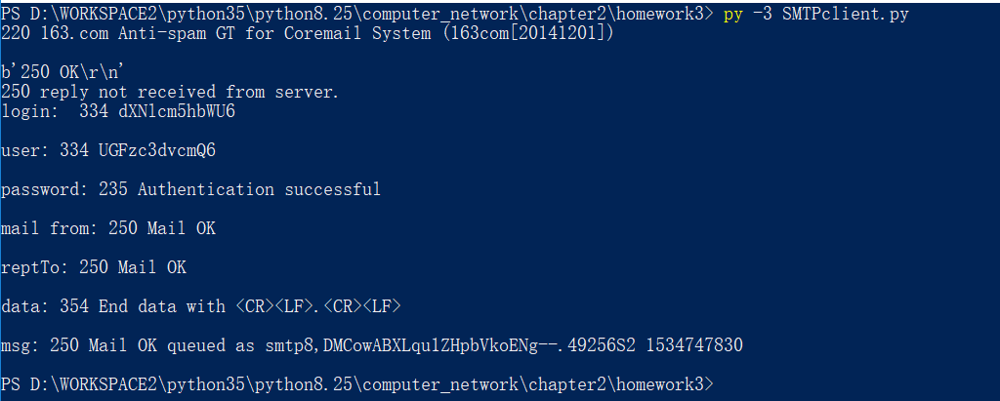
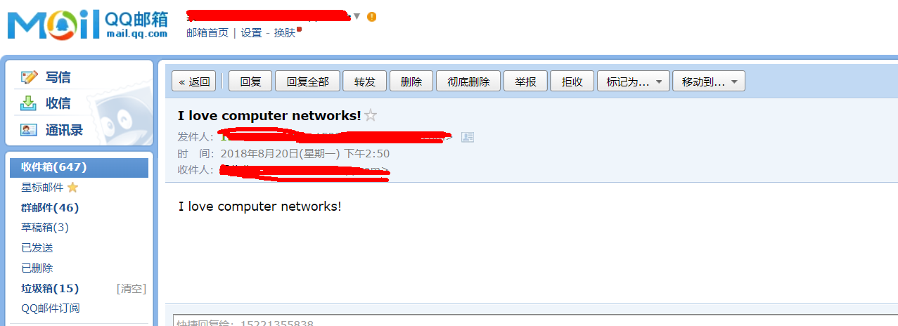

# 作业3 邮件客户

## 作业描述

>这个编程作业的目的是创建一个向任何接收方发送电子邮件的简单邮件客户。你的客户将必须与邮件服务器（如谷歌的电子邮件服务器）创建一个TCP连接，使用SMTP协议与该邮件服务器进行交谈，经该邮件服务器向某接收方（如你的朋友）发送一个电子邮件报文，最后关闭与该邮件服务器的TCP连接。

>对本作业，配套Web站点为你的客户提供了框架代码。你的任务是完善该代码并通过向不同的用户账户发送电子邮件来测试你的客户。你也可以尝试通过不同的服务器（例如谷歌的邮件服务器和你所在大学的邮件服务器）进行发送。

## 详细描述

[Socket3_SMTP.pdf](Socket3_SMTP.pdf)

## 实现

  本文采用163邮箱来完成。首先明确一下SMTP的验证方式：

1. C：auth login ----------------------------------------- 进行用户身份认证 
2. S：334 VXNlcm5hbWU6 ----------------------------------- BASE64编码“Username:”
3. C：用户名，使用BASE64编码
4. S：334 UGFzc3dvcmQ6 ----------------------------------- BASE64编码"Password:"
5. C：密码，使用BASE64编码
6. S：235 auth successfully ------------------------------ 身份认证成功

总的代码如下：

    from socket import *
    import base64

    subject='I love computer networks!'
    contenttype="text/plain"
    msg = "I love computer networks!"
    endmsg = "\r\n.\r\n"
    # Choose a mail server (e.g. Google mail server) and call it mailserver 
    mailserver = "smtp.163.com"#Fill in start   #Fill in end

    fromaddress="***@163.com"
    toaddress="***@qq.com"

    #验证信息，采用BASE64编码用户名和密码
    username=base64.b64encode(b"***@163.com").decode()+'\r\n'
    password=base64.b64encode(b"***").decode()+'\r\n'

    # Create socket called clientSocket and establish a TCP connection with mailserver
    #Fill in start
    clientSocket=socket(AF_INET, SOCK_STREAM)#创建套接字，采用TCP连接，ip地址32位
    clientSocket.connect((mailserver,25))#服务器域名smtp.163.com，SMTP默认端口号25

    #Fill in end
    recv = clientSocket.recv(1024).decode()
    print(recv)
    if recv[:3] != '220':
        print('220 reply not received from server.')

    # Send HELO command and print server response.
    #发送HELO命令，与服务器交互，服务器返回状态码250（请求成功）
    heloCommand = 'HELO Alice\r\n'
    clientSocket.send(heloCommand.encode())
    recv1 = clientSocket.recv(1024)
    print(recv1)
    if recv1[:3] != '250':
        print('250 reply not received from server.')

    #发送"AUTH LOGIN"命令，开始验证身份，服务器将返回状态码334（服务器等待用户输入验证信息）。
    login='AUTH LOGIN\r\n'
    clientSocket.send(login.encode())
    recv=clientSocket.recv(1024).decode()
    print('login: ',recv)
    if(recv[:3] != '334'):
        print('334 reply not received from server')

    #发送经过base64编码的用户名（本例中是163邮箱的账号），服务器将返回状态码334（服务器等待用户输入验证信息）。
    clientSocket.sendall(username.encode())
    recv=clientSocket.recv(1024).decode()
    print('user:',recv)

    if(recv[:3]!="334"):
        print('334 reply not received from server')

    #发送经过base64编码的密码（本例中是163邮箱的密码），服务器将返回状态码235（用户验证成功）。
    clientSocket.sendall(password.encode())
    recv=clientSocket.recv(1024).decode()
    print('password:',recv)

    if(recv[:3]!='235'):
        print('235 reply not received from server')

    # Send MAIL FROM command and print server response.
    #发送"MAIL FROM"命令，并包含发件人邮箱地址，服务器将返回状态码250（请求成功）。
    mailfrom='MAIL FROM: <***@163.com>\r\n'
    clientSocket.sendall(mailfrom.encode())
    recv=clientSocket.recv(1024).decode()
    print('mail from:',recv)

    if(recv[:3] != '250'):
        print('250 reply not received from server')

    # Send RCPT TO command and print server response.
    #发送"RCPT TO"命令，并包含收件人邮箱地址，服务器将返回状态码250（请求成功）。
    reptTo='RCPT TO: <***@qq.com>\r\n'
    clientSocket.sendall(reptTo.encode())
    recv=clientSocket.recv(1024).decode()
    print('reptTo:',recv)

    if(recv[:3]!='250'):
        print('250 reply not received from server')

    # Send DATA command and print server response.
    #发送"DATA"命令，表示即将发送邮件内容，服务器将返回状态码354（开始邮件输入，以"."结束）。
    data='DATA\r\n'
    clientSocket.sendall(data.encode())
    recv=clientSocket.recv(1024).decode()
    print('data:',recv)

    if(recv[:3] != '354'):
        print('354 reply not received from server')

    # Send message data.
    #发送邮件内容，服务器将返回状态码250（请求成功）。
    message='from:'+fromaddress+'\r\n'
    message+='to:'+toaddress+'\r\n'
    message+='subject:'+subject+'\r\n'
    message+='Content-Type:'+contenttype+'\t\n'
    message+='\r\n'+msg
    clientSocket.sendall(message.encode())

    # Message ends with a single period.
    clientSocket.sendall(endmsg.encode())
    recv=clientSocket.recv(1024).decode()
    print('msg:',recv)
    if(recv[:3]!='250'):
        print('250 reply not received from server')

    # Send QUIT command and get server response.
    #发送"QUIT"命令，断开与邮件服务器的连接。
    clientSocket.sendall('QUIT\r\n'.encode())

    clientSocket.close()

## 运行

### 在邮箱中查看

